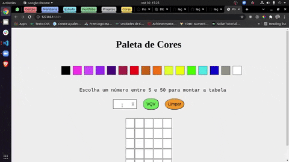

# Boas vindas ao repositório do projeto Pixels Art

Esse projeto foi desenvolvido como um projeto avaliativo do curso de Desenvolvimento Web da [Trybe](https://www.betrybe.com/?utm_medium=cpc&utm_source=google&utm_campaign=Brand&utm_content=ad03_din_h), o objetivo desse projeto era construir uma aplicação onde seria possivel criar artes pixeladas, as tecnologias usadas para desenvolver esse projeto foram HTML, CSS e JavaScript.

Feito apenas com propósitos educacionais.

---

## Preview do projeto

---

## Instalação do projeto localmente

Após cada um dos passos, haverá um exemplo do comando a ser digitado para fazer o que está sendo pedido, caso tenha dificuldades e o exemplo não seja suficiente, não hesite em me contatar em *iago.pferreiravr@gmail.com*.

Passo 1. Abra o terminal e crie um duretório no local de sua preferência com o comando `mkdir`:

~~~bash
mkdir projetos-iago
~~~

Passo 2. Entre no diretório que você acabou de criar:

~~~bash
cd projetos-iago
~~~

Passo 3. Clone o projeto:

~~~bash
git clone git@github.com:IagoPFerreira/pixels-art.git
~~~

Passo 4. Após terminado a clonagem, abra o diretório clonado e dê um duplo clique no arquivo `index.html` e o projeto vai abrir em seu navegador, não é necessário instalar mais nada.

---

## Link para o deploy

<https://iagopferreira.github.io/pixels-art>

## Link para o repositorio do projeto

<https://github.com/IagoPFerreira/pixels-art>
